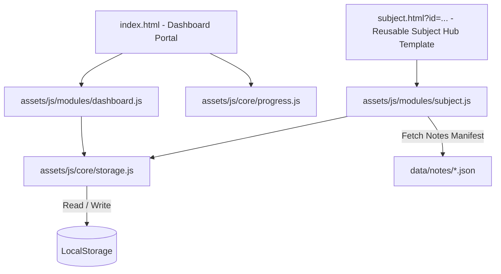

## 🎯 GATE 2027 CSE Preparation Workspace

A premium, high-performance, offline-first personal productivity dashboard and curriculum tracking workspace. Inspired by modern application interfaces (Apple, Notion, Linear, and Arc Browser), this system serves as the master command center for a 13-subject GATE Computer Science & Engineering preparation track.

---

## 🚀 Key Features

- **SaaS-Grade Shell Layout**: Left-navigation sidebar (fully responsive drawer on mobile) and a sticky glassmorphism topbar featuring breadcrumb indicators and a real-time clock.
- **Interactive Telemetry (Chart.js)**:
  - **Syllabus Doughnut**: Circular representation of overall curriculum completion.
  - **Subject Breakdown Chart**: Horizontal bar chart reflecting progress across all subjects in matching theme color codes.
  - **Study Velocity Tracker**: Weekly chart displaying task completion rates.
- **Dynamic Streak Calculation**: Automatic study streak validation that checks actual planner completion dates against your schedule to calculate consecutive study days.
- **CORS-Resilient Offline Mode**: Direct fallback logic that enables double-clicking `index.html` to run perfectly in local file protocols (`file:///`) bypassing strict CORS constraints.
- **Highly Responsive Mobile Layouts**: Custom mobile media queries tailored for simulated smartphone viewports (e.g. Samsung Galaxy S8+ at 360px wide) featuring wrapped task titles, stacked controls, and a responsive tab grid.

---

## 📊 System Architecture



---

## 📁 Directory Structure

```text
GATE-2027/
│
├── index.html                      # Central Dashboard Portal
├── README.md                       # Architecture Documentation
│
├── data/
│   └── subjects.json               # Master subject list (icons, accent colors, total tasks)
│
├── assets/
│   ├── css/
│   │   ├── common.css              # Base Design Tokens, Reset, Topbar & Sidebar Shell
│   │   └── components/
│   │       ├── dashboard.css       # Hero Section, Stats Matrix & Doughnut Chart Styles
│   │       ├── subjects.css        # Subject Cards Grid & Status Badges
│   │       └── planner.css         # Subject Header Panel, Notes Grid & Phase 2 Card Styles
│   │
│   └── js/
│       ├── core/
│       │   ├── utils.js            # GateUtils: Counter/Percentage Animations & DOM Helpers
│       │   ├── storage.js          # GateStorage & GateProgress: LocalStorage Sync Engine
│       │   └── ui.js               # GateUI: Real-Time Header Clock & Sidebar Drawer Controller
│       │
│       ├── services/
│       │   ├── subject-service.js  # GateSubjectService: Model Data & Subject Card Renderer
│       │   ├── progress-service.js # GateProgressService: Stats Aggregator & Chart.js Engine
│       │   └── planner-service.js  # GatePlannerService: Subject Hub Schedules & Notes Grid
│       │
│       └── app.js                  # Central Controller Entry Point & Page Router
│
└── subjects/
    └── subject.html                # Reusable Dynamic Subject Hub Template
```

---

## 💾 LocalStorage Data Schema

The tracking state is synchronized dynamically in your browser's local cache using the following standardized schemas:

### 1. Subject Overall Progress (`gate_2027_progress_map`)
Tracks the aggregated task completeness for each subject:
```json
{
  "os": {
    "completedTasks": 12,
    "totalTasks": 41,
    "percentage": 29,
    "updatedAt": "2026-07-05T14:00:00.000Z"
  }
}
```

### 2. Granular Task Progress Tracker (`gateTracker`)
Tracks lecture-level completed items, current planner schedules, and completion histories:
```json
{
  "subjects": {
    "os": {
      "checkedTasks": [
        "os_d1_l1",
        "os_d1_l2"
      ],
      "lastActiveDate": "2026-07-06",
      "completionHistory": {
        "2026-07-06": true
      }
    }
  }
}
```

### 3. Study Streak Tracker (`gate_2027_streak_data`)
Stores continuous streak levels:
```json
{
  "currentStreak": 2,
  "bestStreak": 5,
  "lastStudyDate": "2026-07-06"
}
```

### 4. Continue Study Route (`gate_2027_last_active`)
Stores the ID string of the last visited module (e.g. `"os"`) to power the "Continue Last Subject" action button.

---

## 🎨 Design System

- **Color Palette**: Ultra-dark violet backdrop (`#06040a` to `#0b0814`) layered with glassmorphic cards and bright subject accent glows (Purple, Blue, Emerald Green, Indigo, etc.).
- **Typography System**: Imported via Google Fonts APIs:
  - Headers: **Outfit** (sleek, modern geometric weight)
  - Body Copy: **Inter** (neutral, highly-legible interface layout)
  - Coding/Telemetry: **JetBrains Mono** (crisp, monospaced details)

---

## 🛠️ Getting Started

1. Clone or download this project repository.
2. Open `index.html` in any modern web browser.
3. Choose a subject card (e.g., **Operating System**) to navigate to its study hub and access notes, DPPs, and study resources!
