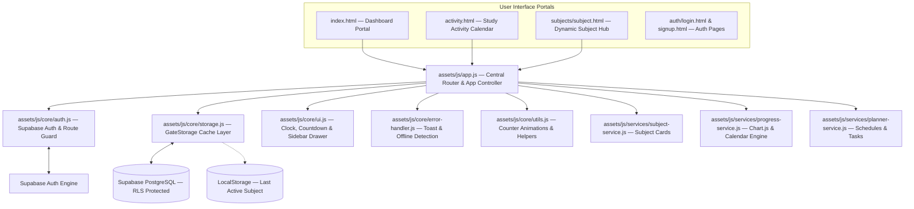

# 🎯 GATE 2027 CSE Preparation Workspace

A premium, high-performance, cloud-synchronized personal productivity dashboard and curriculum tracking workspace. Inspired by modern application interfaces (**Apple, Notion, Linear, and Arc Browser**), this system serves as the master command center for a 13-subject GATE Computer Science & Engineering preparation track.

Built with a **zero-framework, lightweight architecture** (HTML5, CSS3, Vanilla ES6+ JavaScript), it delivers near-instantaneous load times and seamless cross-device synchronization powered by **Supabase**.

---

## 🚀 Key Features

- **SaaS-Grade Shell Layout**:
  - Left-navigation sidebar with desktop collapsible state and responsive mobile drawer.
  - Sticky glassmorphism topbar featuring a **live countdown timer** to estimated completion (15 Dec 2026).
  - Ambient background glow matching subject accent colors.

- **Interactive Telemetry & Metrics**:
  - **Syllabus Doughnut (Chart.js)**: Circular completion gauge with smooth cubic-bezier percentage rollups.
  - **8-Metric Telemetry Matrix**: Real-time counters for Total/Completed/Remaining Subjects, Total/Completed/Remaining Tasks, Target Completion Date, and Active Days.
  - **Month-by-Month Activity Heatmap (`activity.html`)**: Visual calendar tracking daily task density (No activity, 1–2 tasks, 3+ tasks) starting from September 2026.

- **Dynamic Subject Hub & Study Planner (`subjects/subject.html`)**:
  - **Dynamic Theming Engine**: Custom CSS variable engine applying unique accent glows and color palettes for all 13 GATE subjects.
  - **Hierarchical Day Cards**: Structured day cards with date labels, topic groups, and lecture/DPP checklists.
  - **Reward & Celebration System**: Automatic 50-piece multi-colored confetti burst and celebratory modal upon 100% subject completion.
  - **Modular Navigation**: Dedicated tabs for Study Planner, Notes, PYQs, and Formula Sheets.

- **Supabase Cloud Sync & Security**:
  - **Authentication**: Email/password registration and session management with pre-render loading overlay protection.
  - **Cloud Persistence**: PostgreSQL database backing progress, user profiles, and granular lecture completion records.
  - **Row Level Security (RLS)**: Strict user-isolated policies ensuring complete data privacy.

- **Resilience & Offline Handling**:
  - Automatic offline detection with a sticky warning banner and reconnect toasts.
  - Centralized error mapping and non-intrusive toast notifications.
  - In-memory cache layer (`GateStorage`) providing optimistic UI updates.

---

## 📊 System Architecture



---

## 📁 Directory Structure

```text
GATE-2027/
│
├── index.html                      # Central Dashboard Portal (Donut chart & 8-metric matrix)
├── activity.html                   # Study Activity & Monthly Calendar Heatmap Portal
├── README.md                       # Comprehensive Architecture Documentation
│
├── auth/
│   ├── login.html                  # User Authentication Log In Page
│   └── signup.html                 # User Registration Sign Up Page
│
├── data/
│   ├── subjects.json               # Master subject list (icons, accents, total tasks)
│   └── os/
│       └── planner.json            # Operating System 5-day curriculum schedule & tasks
│
├── supabase/
│   └── migrations/
│       └── setup.sql               # Consolidated database migration & RLS schema
│
├── assets/
│   ├── css/
│   │   ├── common.css              # Design Tokens, Reset, Topbar, Sidebar & Toast styles
│   │   ├── auth.css                # Authentication Forms & Page Styling
│   │   └── components/
│   │       ├── dashboard.css       # Hero Section, Stats Matrix & Doughnut Gauge Styles
│   │       ├── subjects.css        # Subject Cards Grid & Status Badges
│   │       ├── planner.css         # Sticky Header, Day Cards, Dynamic Theming & Confetti
│   │       └── activity.css        # Study Activity Month Cards & Heatmap Grid Styling
│   │
│   └── js/
│       ├── config/
│       │   ├── config.js           # Supabase credentials & Application Constants
│       │   └── config.example.js   # Configuration template for deployment
│       │
│       ├── core/
│       │   ├── auth.js             # GateAuthService & GateAuthManager (Route Guard)
│       │   ├── storage.js          # GateStorage, GateProgress & GateProfileService
│       │   ├── ui.js               # GateUI (Live Countdown Timer & Mobile Drawer)
│       │   ├── utils.js            # GateUtils (Cubic Easing Animations & Date Formatters)
│       │   └── error-handler.js    # GateErrorHandler (Toast Notifications & Offline Banner)
│       │
│       ├── services/
│       │   ├── subject-service.js  # GateSubjectService (Card Generator & Accent Mapper)
│       │   ├── progress-service.js # GateProgressService (Chart.js Donut & Activity Calendar)
│       │   └── planner-service.js  # GatePlannerService (Subject Hub, Day Cards & Confetti)
│       │
│       └── app.js                  # Application Controller Entry Point & Route Initializer
│
└── subjects/
    └── subject.html                # Reusable Dynamic Subject Hub & Planner Template
```

---

## 🗄️ Supabase Database Schema

The workspace synchronizes dynamically across devices using the following PostgreSQL schema defined in [`supabase/migrations/setup.sql`](supabase/migrations/setup.sql):

### 1. User Profiles (`profiles`)
Stores user identity and display preferences:
- `id` (UUID, primary key) — References `auth.users.id` (cascades on delete)
- `email` (TEXT) — User email address
- `display_name` (TEXT, default `'GATE Aspirant'`) — Custom display name
- `created_at` / `updated_at` (TIMESTAMPTZ) — Automatically managed by triggers

### 2. Master Subjects (`subjects`)
Defines the 13 GATE CSE subjects:
- `id` (TEXT, primary key) — Unique slug (e.g. `'os'`, `'coa'`, `'dbms'`)
- `name` (TEXT) — Full subject title
- `icon` (TEXT) — Lucide icon identifier (e.g. `'terminal'`, `'cpu'`)
- `accent` (TEXT) — Theme accent token (e.g. `'blue'`, `'purple'`)
- `total_tasks` (INTEGER, default `0`) — Total curriculum tasks
- `sort_order` (INTEGER) — Dashboard ordering

### 3. Subject Overall Progress (`subject_progress`)
Tracks aggregated completion per subject for each user:
- `id` (UUID, primary key)
- `user_id` (UUID, references `auth.users.id`)
- `subject_id` (TEXT, references `subjects.id`)
- `completed_tasks` (INTEGER, default `0`)
- `total_tasks` (INTEGER, default `0`)
- `percentage` (INTEGER, 0–100)
- `UNIQUE (user_id, subject_id)`

### 4. Granular Task Completions (`task_completions`)
Tracks lecture-level completed items and dates:
- `id` (UUID, primary key)
- `user_id` (UUID, references `auth.users.id`)
- `task_id` (TEXT) — Unique task ID (e.g. `'os-d1-t1-l1'`)
- `subject_id` (TEXT, references `subjects.id`)
- `is_completed` (BOOLEAN, default `true`)
- `completed_at` (TIMESTAMPTZ) — Exact completion timestamp
- `completed_date` (DATE) — Date formatted `YYYY-MM-DD` (powers activity heatmaps)
- `UNIQUE (user_id, task_id)`

### 5. Client LocalStorage Cache
Lightweight client-only state:
- `gate_2027_last_active` (TEXT) — Tracks the last visited subject (e.g. `'os'`) for quick continuation.

---

## 📚 Curriculum Status

| Subject | Accent | Icon | Status | Total Tasks |
|---|---|---|---|:---:|
| **Operating System** | Blue | `terminal` | **Active** (5-Day Structured Planner) | **41** |
| **Computer Organization & Architecture** | Purple | `cpu` | Roadmap In Preparation | 0 |
| **DBMS** | Cyan | `database` | Roadmap In Preparation | 0 |
| **Computer Networks** | Emerald | `globe` | Roadmap In Preparation | 0 |
| **Data Structures** | Indigo | `layers` | Roadmap In Preparation | 0 |
| **Algorithms** | Violet | `git-branch` | Roadmap In Preparation | 0 |
| **Theory of Computation** | Teal | `settings` | Roadmap In Preparation | 0 |
| **Compiler Design** | Rose | `code-2` | Roadmap In Preparation | 0 |
| **Digital Logic** | Amber | `binary` | Roadmap In Preparation | 0 |
| **Engineering Mathematics** | Orange | `calculator` | Roadmap In Preparation | 0 |
| **Discrete Mathematics** | Pink | `hash` | Roadmap In Preparation | 0 |
| **C Programming** | Sky | `file-code` | Roadmap In Preparation | 0 |
| **General Aptitude** | Green | `lightbulb` | Roadmap In Preparation | 0 |

---

## 🎨 Design System

- **Color Palette**: Deep space obsidian backdrop (`#06040a` to `#0b0814`) layered with glassmorphic panels (`rgba(255, 255, 255, 0.04)`), frosted borders, and dynamic radial glows.
- **Dynamic Accent System**: HSL/RGB tailored tokens for all 13 subjects (`--accent-blue`, `--accent-purple`, `--accent-emerald`, etc.).
- **Typography**:
  - **Headings**: `Outfit` (600/700/800 geometric weight)
  - **Body Text**: `Inter` (400/500/600 neutral layout)
  - **Telemetry & Clocks**: `JetBrains Mono` (crisp monospaced figures)

---

## 🛠️ Getting Started

1. **Clone the Repository**:
   ```bash
   git clone https://github.com/Hit-Damani/GATE.git
   cd GATE
   ```

2. **Database Setup**:
   - Create a project on [Supabase](https://supabase.com/).
   - Open **SQL Editor** in the Supabase Dashboard.
   - Run the consolidated migration script found in [`supabase/migrations/setup.sql`](supabase/migrations/setup.sql).

3. **Configure Environment**:
   - Update [`assets/js/config/config.js`](assets/js/config/config.js) with your `SUPABASE_URL` and `SUPABASE_ANON_KEY`.

4. **Launch Workspace**:
   - Open `index.html` directly in any modern web browser or serve with a local static server:
     ```bash
     npx serve .
     ```
   - Create an account on the Sign Up page and start tracking your preparation!
