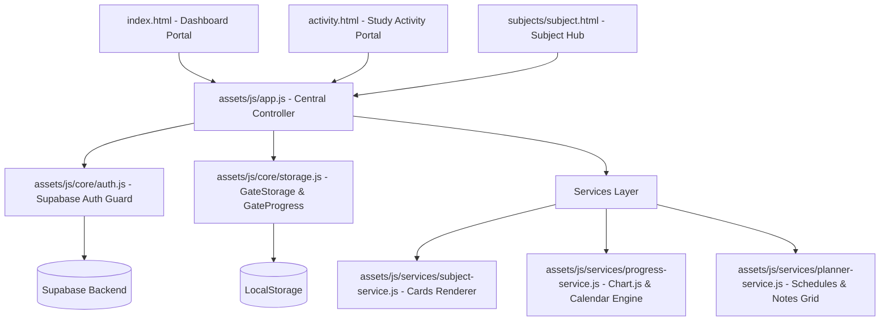

## 🎯 GATE 2027 CSE Preparation Workspace

A premium, high-performance, cloud-synchronized personal productivity dashboard and curriculum tracking workspace. Inspired by modern application interfaces (Apple, Notion, Linear, and Arc Browser), this system serves as the master command center for a 13-subject GATE Computer Science & Engineering preparation track.

---

## 🚀 Key Features

- **SaaS-Grade Shell Layout**: Left-navigation sidebar (fully responsive drawer on mobile) and a sticky glassmorphism topbar featuring breadcrumb indicators and a real-time clock.
- **Interactive Telemetry (Chart.js)**:
  - **Syllabus Doughnut**: Circular representation of overall curriculum completion.
  - **Subject Breakdown Chart**: Horizontal bar chart reflecting progress across all subjects in matching theme color codes.
  - **Study Velocity Tracker**: Weekly chart displaying task completion rates.
- **Supabase Cloud Sync & Core Auth**: Integrates user registrations/sessions via Supabase Auth and database operations (PostgreSQL) for progress and telemetry persistence across multiple devices.
- **Highly Responsive Mobile Layouts**: Custom mobile media queries tailored for simulated smartphone viewports (e.g. Samsung Galaxy S8+ at 360px wide) featuring wrapped task titles, stacked controls, and a responsive tab grid.

---

## 📊 System Architecture



---

## 📁 Directory Structure

```text
GATE-2027/
│
├── index.html                      # Central Dashboard Portal
├── activity.html                   # Study Activity & Calendar Portal
├── README.md                       # Architecture Documentation
│
├── auth/
│   ├── login.html                  # User Authentication Log In Page
│   └── signup.html                 # User Registration Sign Up Page
│
├── data/
│   └── subjects.json               # Master subject list (icons, accent colors, total tasks)
│
├── assets/
│   ├── css/
│   │   ├── common.css              # Base Design Tokens, Reset, Topbar & Sidebar Shell
│   │   ├── auth.css                # Authentication Forms & Page Styling
│   │   └── components/
│   │       ├── dashboard.css       # Hero Section, Stats Matrix & Doughnut Chart Styles
│   │       ├── subjects.css        # Subject Cards Grid & Status Badges
│   │       ├── planner.css         # Subject Header Panel, Notes Grid & Phase 2 Card Styles
│   │       └── activity.css        # Study Activity Month Cards & Grid Styling
│   │
│   └── js/
│       ├── config/
│       │   ├── config.js           # Supabase client environment variables & App Constants
│       │   └── config.example.js   # Template file for environment configurations
│       │
│       ├── core/
│       │   ├── utils.js            # GateUtils: Counter/Percentage Animations & DOM Helpers
│       │   ├── storage.js          # GateStorage & GateProgress: LocalStorage Sync Engine
│       │   ├── ui.js               # GateUI: Real-Time Header Clock & Sidebar Drawer Controller
│       │   ├── auth.js             # GateAuthService & GateAuthManager: Supabase Auth Guard
│       │   └── error-handler.js    # GateErrorHandler: Global User Feedback Toast Notifications
│       │
│       ├── services/
│       │   ├── subject-service.js  # GateSubjectService: Model Data & Subject Card Renderer
│       │   ├── progress-service.js # GateProgressService: Stats Aggregator & Chart.js Engine
│       │   └── planner-service.js  # GatePlannerService: Subject Hub Schedules & Notes Grid
│       │
│       └── app.js                  # Central Controller Entry Point & Page Router
│
└── subjects/
    └── subject.html                # Reusable Dynamic Subject Hub Template
```

---

## 🗄️ Supabase Database Schema

The tracking state is synchronized dynamically across devices using the following Supabase database schemas:

### 1. User Profiles (`profiles`)
Stores user identity metadata:
- `id` (uuid, primary key) - References `auth.users`
- `email` (text) - User email address
- `display_name` (text) - Custom user display name (defaults to "GATE Aspirant")
- `created_at` (timestamp with time zone)

### 2. Subject Overall Progress (`subject_progress`)
Tracks the aggregated task completeness for each subject per user:
- `user_id` (uuid, references `auth.users`, composite primary key)
- `subject_id` (text, composite primary key) - e.g., "os", "coa", "dm"
- `completed_tasks` (integer) - Count of completed tasks
- `total_tasks` (integer) - Total tasks in the curriculum
- `percentage` (integer) - Completion percentage (0 to 100)
- `updated_at` (timestamp with time zone)

### 3. Granular Task Completions (`task_completions`)
Tracks lecture-level completed items and dates:
- `user_id` (uuid, references `auth.users`, composite primary key)
- `task_id` (text, composite primary key) - Unique task ID, e.g. "os_d1_l1"
- `subject_id` (text) - e.g., "os"
- `is_completed` (boolean)
- `completed_at` (timestamp with time zone)
- `completed_date` (date) - Clean date in `YYYY-MM-DD` format (powers the study calendar)

### 4. Client LocalStorage Cache
Only the following lightweight state is stored locally:
- `gate_2027_last_active` (text) - Stores the ID of the last visited subject (e.g. `"os"`) to power the "Continue Last Subject" button.

---

## 🎨 Design System

- **Color Palette**: Ultra-dark violet backdrop (`#06040a` to `#0b0814`) layered with glassmorphic cards and bright subject accent glows (Purple, Blue, Emerald Green, Indigo, etc.).
- **Typography System**: Imported via Google Fonts APIs:
  - Headers: **Outfit** (sleek, modern geometric weight)
  - Body Copy: **Inter** (neutral, highly-legible interface layout)
  - Coding/Telemetry: **JetBrains Mono** (crisp, monospaced details)

---

## 🛠️ Getting Started

1. Clone or download this project repository.
2. Open `index.html` in any modern web browser.
3. Choose a subject card (e.g., **Operating System**) to navigate to its study hub and access notes, DPPs, and study resources!
